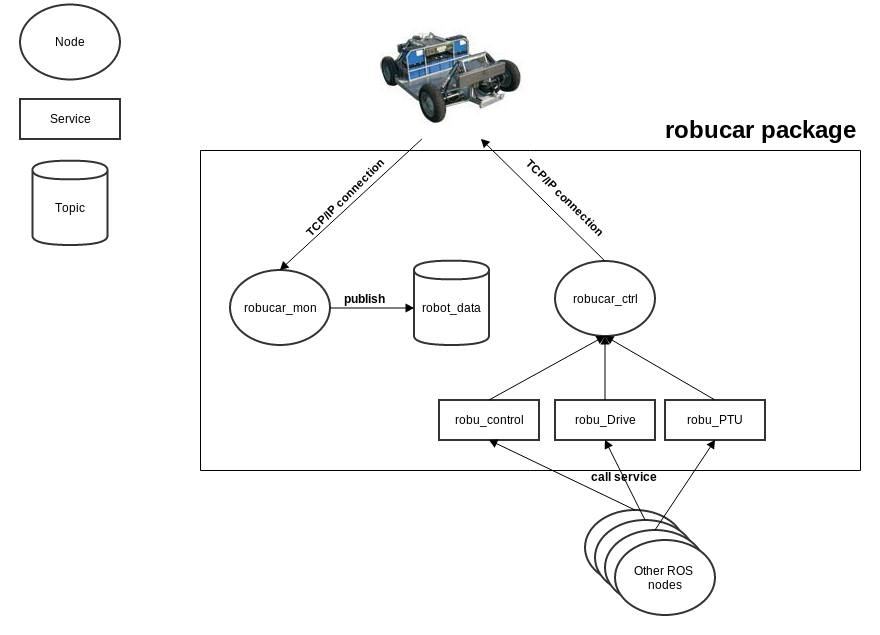

Robucar CDTA 
============

##1. Introduction:

ROS package to offer an interface to communicate with the CDTA's Robucar (send commmands for PTU and for Driving the Robot, and receiving data from robucar) 

This package implements two nodes:

###a. robucar\_ctrl (implemented in robucar\_control.py):  
	
This node offer the TCP client class that connects to Robucar server and publish three services :

**1. robu_control:** uses the srv message type RobotCtrl.

**2. robu_Drive:** uses the srv message type RobotDrive.

**3. robu_PTU:** uses the srv message type RobotPTU.

**robu_control is the recommended way to control the RobuCar.**

###b. robucar\_mon (implemented in robucar\_monitor.py):

This node publishes data read from the robucar the "robot_data" topic.

-------------

##2. Functional diagram:

Here is a simple diagram explaining how this package operate.

-------------

##3. Data:

Data read from the robucar is published in by the "robucar\_mon" node to the "robot_data" topic 

Data received is formated as follows:

| variable        | python types | C types    | ROS msg type |
|:--------------- |:------------ |:---------- |:------------ |
| speed_average   | float        | double     | float64      | 
| speed_FL        | float        | double     | float64      | 
| speed_FR        | float        | double     | float64      | 
| speed_RL        | float        | double     | float64      |  
| speed_RR        | float        | double     | float64      | 
| angle_forward   | float        | double     | float64      |  
| angle_rear      | float        | double     | float64      |  
| position_pan    | int          | short int  | int16        |   
| position_tilt   | int          | short int  | int16        |   
| speed_pan       | int          | short int  | int16        |  
| speed_tilt      | int          | short int  | int16        |  

Data sent to command the RobuCar & PTU is sent via services :

**1.   robu_control:** used to set and send all the data.

**2.  robu_Drive:**   used to set the speed and the steering angles while PTU data will be copyed from previous command

**3. robu_PTU:** used to set the PTU data while the rest will be copyed from previous command

**in all cases data sent to the robucar should contain all parameters**

data sent is formated as follows :

| variable        | python types | C types    | ROS msg type |
|:--------------- |:------------ |:---------- |:------------ |
| speed           | float        | double     | float64      | 
| angle_forward   | float        | double     | float64      | 
| angle_rear      | float        | double     | float64      | 
| position_tilt   | int          | short int  | int16        |   
| position_pan    | int          | short int  | int16        |   
| speed_pan       | int          | short int  | int16        |  
| speed_tilt      | int          | short int  | int16        |  

-------------

##4. License:
BSD