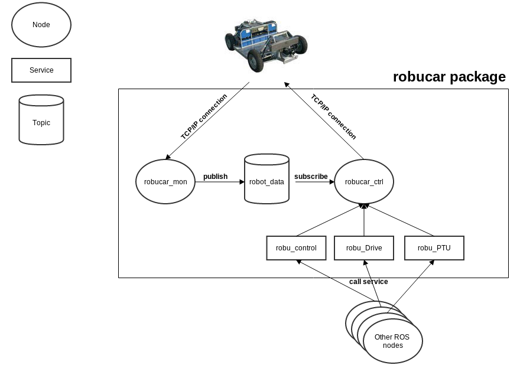

robucar_driver for CDTA's Robucar 
=================================

##1. Introduction:

ROS package to offer an interface to communicate with the CDTA's Robucar (send commmands for PTU and for Driving the Robot, and receiving data from robucar) 

This package implements two nodes:

###a. robucar\_ctrl (implemented in robucar\_control.py):  
	
This node offer the TCP client class that connects to Robucar server and publish three services :

**1. robu_control:** uses the srv message type RobotCtrl.

**2. robu_Drive:** uses the srv message type RobotDrive.

**3. robu_PTU:** uses the srv message type RobotPTU.

**robu_control is the recommended way to control the RobuCar. as the other two are not well tested and add just for future hacking**

###b. robucar\_mon (implemented in robucar\_monitor.py):

This node publishes data read from the robucar the "robot_data" topic.

-------------

##2. Functional diagram:

Here is a simple diagram explaining how this package operate.

-------------

##3. Data:

Data read from the robucar is published in by the "robucar\_mon" node to the "robot_data" topic 

Data received is formated as follows:

| variable        | python types | C types    | ROS msg type |
|:--------------- |:------------ |:---------- |:------------ |
| speed_average   | float        | double     | float64      | 
| speed_FL        | float        | double     | float64      | 
| speed_FR        | float        | double     | float64      | 
| speed_RL        | float        | double     | float64      |  
| speed_RR        | float        | double     | float64      | 
| angle_forward   | float        | double     | float64      |  
| angle_rear      | float        | double     | float64      |  
| position_pan    | int          | short int  | int16        |   
| position_tilt   | int          | short int  | int16        |   
| speed_pan       | int          | short int  | int16        |  
| speed_tilt      | int          | short int  | int16        |  

Data sent to command the RobuCar & PTU is sent via services :

**1.   robu_control:** takes all parameters .

**2.  robu_Drive:**   takes speed, angle\_forward, angle\_rea, 

**3. robu_PTU:** takes position\_tilt, position\_pan, speed\_pan, speed\_tilt

**in all cases data sent to the robucar should contain all parameters**

data sent is formated as follows :

| variable        | python types | C types    | ROS msg type |
|:--------------- |:------------ |:---------- |:------------ |
| speed           | float        | double     | float64      | 
| angle_forward   | float        | double     | float64      | 
| angle_rear      | float        | double     | float64      | 
| position_tilt   | int          | short int  | int16        |   
| position_pan    | int          | short int  | int16        |   
| speed_pan       | int          | short int  | int16        |  
| speed_tilt      | int          | short int  | int16        |  

-------------

##4. License:
BSD
